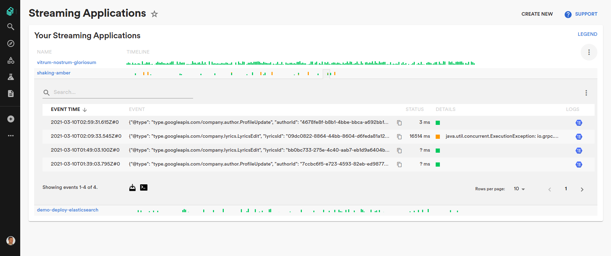

# Spīve

Event-sourcing and collaboration platform

- 

Danger: very aspirational [README-driven development](https://tom.preston-werner.com/2010/08/23/readme-driven-development.html).

## Quick Start

A basic "walking skeleton" can be launched in a `docker compose` environment:

    ./tools/dev-0/start.sh

Teaser trailer (not there yet):

## Why

Spīve's primary goal is to boost productivity in software engineering, concretely - simplify development and management of event-driven applications, ranging from near-real time data processing pipelines to microservices, websites and enterprise internal tools.

A secondary goal is to build out a platform where business logic is neatly delineated from infrastructure concerns, such as event storage. This gives you greater power to carry out blanket optimizations across all your owned applications, thus achieving resource economy, as well as strategic capability to hop between vendors.

## How

Spīve, as a platform, implements a few relatively non-leaky abstractions for managing consistently ordered, partitioned streams of events, and orchestrates [event-sourced](https://www.cqrs.nu/Faq/event-sourcing) distributed applications that reliably consume and produce such streams.

(Event-sourcing as a paradigm capitalizes on history retention and thus repeatable behaviors. It uncomplicates effective use of in-memory data structures, to marry simple and easy development work with predictable processing performance. Spīve API is designed to directly assist application developers in successfully leveraging these principles.)

A few of the orchestration aspects include:

- automated <abbr title="&quot;Keep The Lights On&quot;">KTLO<abbr> operations, such as instance restoration to healthy and live state by replaying historical events in case of crashes
- assistance in debugging and rollout of code changes
- proactive scaling (by sharding) in anticipation of excessive number of events hitting any single instance
- always up-to-date visualization of data flow between applications

Robust observability is not surprising, given how Spīve stays on top of the entire lifecycle of event streams and the applications which communicate through these streams. (Think of a nightly scheduled job producing statistical model updates into a service, then maybe a web-based administration tool allowing account managers to enter data in another service, both of them being depended on by a user-facing app server, and so on.) Tens and hundreds of interdependent applications, distributed on thousands of instances, can be easily operated and understood on a "single pane of glass" interface. The rich interactive visualization comes in especially handy when a software system grows to more than one development/operations team and its architecture evolves through years.

Spīve API strives to abstract away storage and encoding of events - the application developer/owner should be enabled to work "in language" without extraneous concern about where technically the events came from and where they went. Spīve guarantees that deployed application code will keep executing in a consistent and timelyTBD fashion to react to incoming events, or otherwise application owners will get alerted.

Under the hood, the Spīve abstractions around event handling unlock a slew of blanket optimizations that can be applied transparently. Examples include microbatching to trade off latency against throughput, moving the persisted event streams between differently priced storages, moving the computation between different machine types, etc.

Another upside is that the persisted events are easily available for offline analytical processing in notebooks and batch pipelines, with minimal effort to extract accurate data. No more "data collection as an afterthought".

## Limitations and tradeoffs

Spīve can be thought of as a workflow engine, akin to e.g. [AWS SWF](https://docs.aws.amazon.com/amazonswf/latest/developerguide/swf-welcome.html), [Temporal](https://github.com/temporalio/temporal) or [Infinitic](https://github.com/infiniticio/infinitic), yet centers on a different, lower level of abstraction, in terms of concepts supported by its SDK.

Spīve UX, on the other hand, strives to achieve new heights in coherent orchestration of interconnected applications, with joy-sparking reliability and manageability. DevOps-friendly and microservices-friendly, preserves maintainability of codebases small and large, especially such that evolve in a distributed fashion, touched by any number of autonomous contributing teams.

Use-case wise, Spīve most readily works for backend services serving low write volumes, and any read volumes. State machines, workflows and sagas are common patterns. Moreover, near-real time pipelines and batch processes that ship data in and out of the backend are very efficient to write and test, and deploy alongside the services, in a greatly unified development experience.

On a scale from "a highly optimized query engine for detecting near-Earth asteroids on a specialized astronomy mainframe" to "keep shipping and tweaking features our users value, and don't break the Jenga tower", quite a lot of software systems belong in the latter end, the "long, fat tail" of smallish but business critical systems. Recognizing the significant engineering overhead and accidental complexity present in this area, the design of Spīve platform readily trades off processor cycles in favor of cutting engineering toil, tightening the development feedback loop, and reducing mean time to incident resolution.

Many Big Data problems can just as well benefit from event-sourcing model, especially if the problem is [embarrassingly parallel](https://en.wikipedia.org/wiki/Embarrassingly_parallel). In any case, Spīve is not a blob store, nor yet another Big Data analytics engine with faster queries or anything of that sort. Spīve API makes different tradeoffs than those familiar to Beam or Hadoop users:

- Serializability of [event handler](API.md#Event_handlers) code to transfer it to distributed workers is not required - on the contrary, the application code (image, resp. jar) is deployed and executed as-built, usually on a set of virtual machine instances.
- Control of per-instance in-memory state using the native constructs of the programming language is facilitated, avoiding superfluous indirection.
- Event handling logic is designed to be single threaded: among simplicity benefits, it should be particularly noted that stacktraces in case of errors tend to be informative and pointing to the relevant places in business logic. Meanwhile, the necessary parallelism for maintaining acceptable performance is achieved via partitioning of streams, resp. by sharding processes into multiple instances.
- Complementing synchronous event handling, the framework embraces [workloads](API.md#Workloads) that run concurrently with event handlers. Workloads are suitable in practice for e.g. serving requests off the in-memory state with low latency and high availability.

Spīve ultimately provides safeguards so that out-of-order events are never observed by the business logic, which is of great help to easily reason about the correctness of application behavior. This needs to be reconciled with the real world circumstances where information may happen to arrive out-of-order though. Instead of exposing late arrival of events as a complicating condition in business logic, Spīve chooses to primarily address this problem through first class versioning of streams, resp. processes, along with convenience automation and orchestration to migrate the world (the dependency graph downstream of the corrupt stream, and their hitherto created side effects) to a corrected version of the event order. (Cf. n-temporal models, backdating.) This comes with recomputation costs that may be formidable yet feasible, a tradeoff for overall productivity gain.

Depending on how suitable your application is for the event-sourcing paradigm, Spīve provides predictably low overhead; "you don't pay for what you don't use".

Last but not least, on the flipside of Spīve's conceptual simplicity lies its ubiquity. Wide variety of supported types of event stores, and adaptation into diverse execution environments allow Spīve to prove itself early, and use your cloud or on-premise resources efficiently as your appetite grows.

## Usage

(TODO hello world example, development flow, operations flow)

See [API reference](API.md).

## Contributing

### Development environment

Backend and application examples are currently developed as a Maven project using Java 19. Set up like:

    curl -s "https://get.sdkman.io" | bash
    source ~/.sdkman/bin/sdkman-init.sh
    sdk install java 19.0.2-open
    sdk install mvnd
    mvnd verify

Frontend uses Qwik, D3 and Material UI. See the respective README.md file for instructions.

### Conventions and opinions

(TODO code, architecture, UX conventions and opinions)

InterruptedException for (indefinitely) blocking methods... Hardly seeing need for other checked exceptions.

Strongly opinionated that common development iteration UX should be blazingly fast, to not break [flow](https://en.wikipedia.org/wiki/Flow_state). Aspire to gamify common chores, such as deployment, scaling, and verification of code changes. Do precompute views, throw hardware at the problem, get UI to [update in split seconds](http://lawsofux.com/en/doherty-threshold/).

[Hermeticity](https://testing.googleblog.com/2012/10/hermetic-servers.html). Spive app is self-hosting, its code seems self-referential to an extent. Astonishingly self-manipulating as a quine it should be _not_. In the same way that a never-halting program tends to be of diminished usefulness in practice - and same can be said of a program whose halting is _unclear_ - we do not want to contort Spīve architecture into a platform that readily mangles itself out in the field - nor one that is _prone to_ mangling itself if a user happens to click the wrong button.

A [TODO list](TODO.md) full of wishes.

## Name

"Spīve" (/spiːve/) is a very underused Latvian word that means roughly "fierceness" or "incisiveness".
